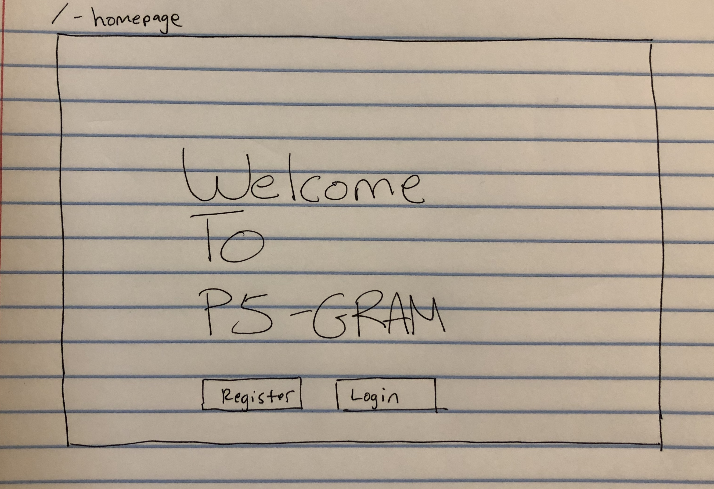
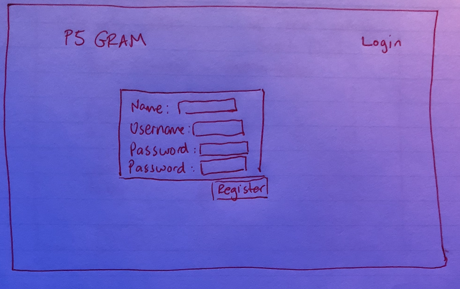
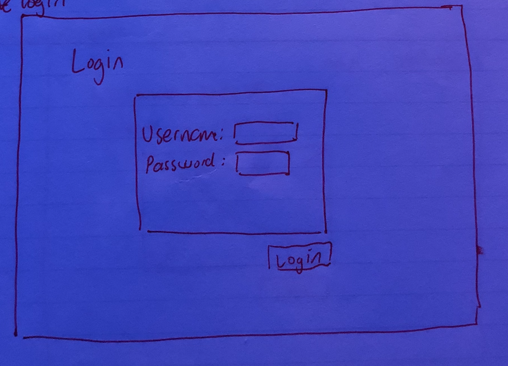
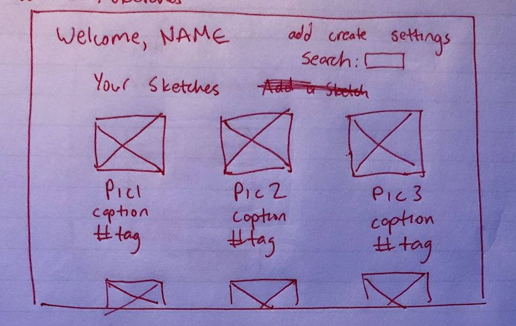
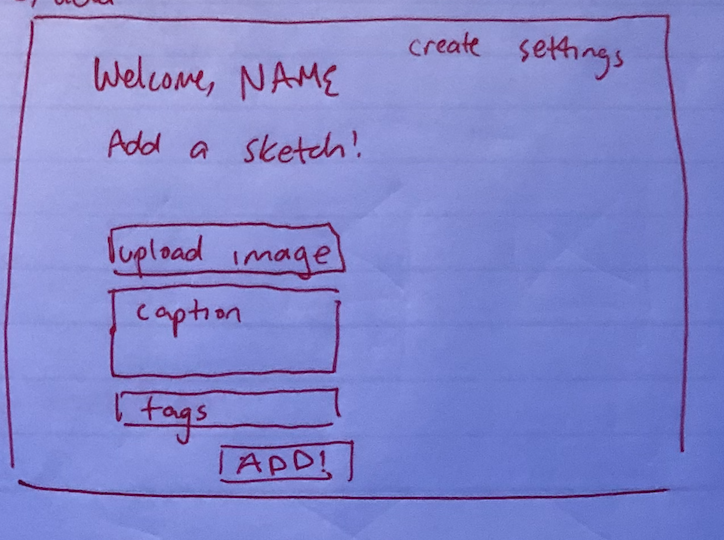
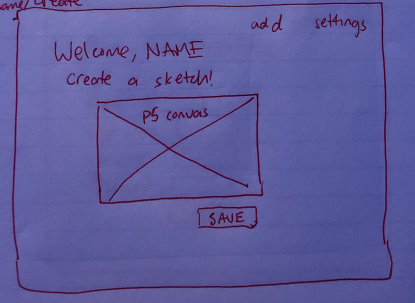
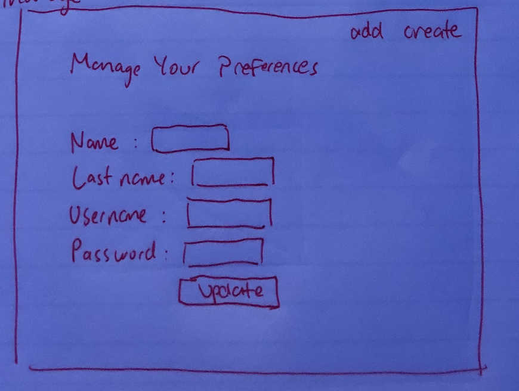
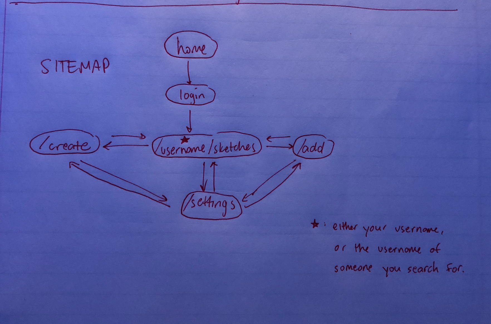

antramirez   
Final Project

# p5-Gram (title still in works)

## Overview

This project will consist of an interactive web drawing app, in which users will be able to create sketches using p5.js and share them in a manner similar to Instagram. The p5 canvas will contain several drawing options for the users, and when they are content, they can add a caption and tags, and then upload their photo to their personal page. A user can also search for other users and see their sketches, but first the user must register and login. This project will also use express and mongoose to serve the various web pages and store user/sketch information, respectively.   


## Data Model:

* user will have an account (username, password, etc.) and a list of sketches
* sketch will have a name, caption, source url, and a date created

Example user:
```javascript
{
  firstName: "anthony",
  lastName: "ramirez",
  username: "antramirez",
  passwordHash: // a password hash,
  sketches: // an array of references to sketches
}
```

Example sketch:
```javascript
{
  name: "my awesome sketch",
  caption: "check out my awesome sketch!",
  tags: "p5 webArt cool",
  url: "www.mysite.com/img/username/1.jpg",
  dateCreated: "Wed Nov 07 2018 22:01:19 GMT-0500"  
}
````


## [Link to Commented First Draft Schema](src/db.js)


## Wireframe
* / - home

* /register - register

* /login - login

* /usr/sketches - display images corresponding to user

* /add - add image to your sketches

* /create - create a p5 sketch

* /settings - manage user preferences



## Site map


## User Stories or Use Cases
1. As a non-registered user, I can sign up / register
2. As a user, I can log in
3. As a logged in user, I can create p5 sketches and save them
4. As a logged in user, I can upload sketches, as well as create captions and tags
5. As a logged in user, I can search for other users and see their sketches


## Research Topics
* Interactive web drawing framework
  * I would like my website to be more interactive than filling out forms
  * p5.js - a frontend javascript library used for web drawings and animations. p5 utilizes an html canvas and allows the user to interact with it with primitive shapes and other images. This will allow for the site to have an interactive drawing app. Usually everything is coded in the script, but I will give the user more power to make it interactive via the sketch. This library is not trivial, but it does not seem extremely difficult. The biggest challenge will be making the drawing app interactive, so I think it is worth 3 points.
* Avoid repetitive tasks while developing
  * Save time and spend more time writing code
  * gulp - a javascript tool is used as a task runner to avoid repetitive tasks. For example, when changes are saved, the browser reloads automatically. Additionally, it automatically compiles Sass to CSS, which I will be using. This is worth 3 points.
* More efficient way of writing styles
  * CSS is limiting sometimes in terms of how to write styles
  * Sass/SCSS - this is essentially a more efficient way of making styles. Sass can also be used with GULP to compile Sass files to CSS. Sass allows for nesting (i.e. easier to write styles for elements within elements). Additionally, Sass allows for variables while styling, so repetitive styles can be simplified using variables. This is worth 2 points.


## [Link to Initial Main Project File](src/app.js)


## Annotations/References used
* p5.js - https://p5js.org/
* gulp - https://gulpjs.com/
* Sass - https://sass-lang.com/
